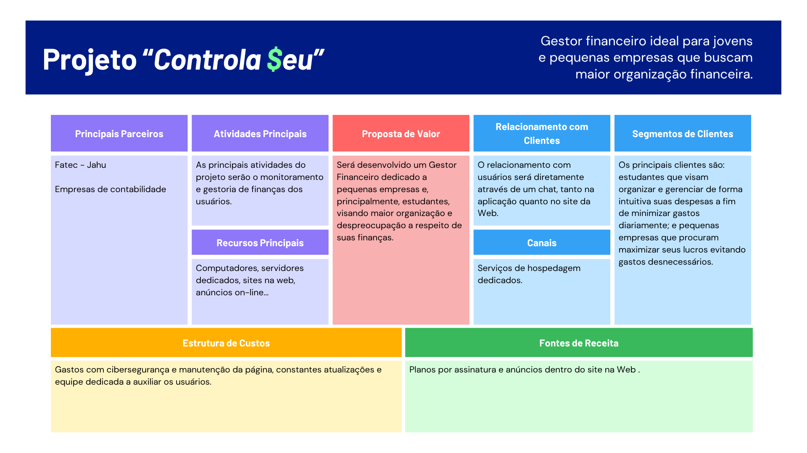
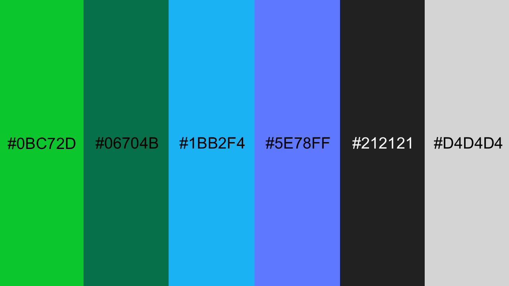

# Projeto **"Controla$EU"**

   *Por: Arthur Cabral, Gabriel Campanhã, Guilherme Claro Pereira e João Guilherme Pascolat.*

# **Objetivo**
O projeto *”Controla$eu”* é focado em auxiliar pessoas jurídicas/físicas (especialmente jovens) a assumirem o controle de suas finanças de forma simples e intuitiva.

# **Metodologias**
Para esse projeto serão usadas as linguagens de programação HTML, CSS e JavaScript, modelos de processo ágeis Kanban e Scrum. Para o design do projeto serão usadas as ferramentas Figma e Photoshop. 

# **Requisitos do Projeto.**

## – Requisitos Funcionais (RF).

* **RF01 – Realizar cadastros:**
    O sistema deve permitir que os usuários criem contas e realizem cadastros de pessoa física ou jurídica.
* **RF02 – Realizar logins:**
    O sistema deve permitir guardar informações dos usuários e utilizá-las para realizar o login dos mesmos.
* **RF03 – Controlar receitas:**
    O sistema deve permitir o usuário registrar suas receitas e transações a fim de acompanhá-las e as monitorar.
* **RF03 – Controlar despesas:**
    O sistema deve permitir com que o usuário documente e organize suas despesas de acordo com sua preferência, buscando mais organização.
* **RF04 – Registrar datas:**
    O sistema deve registrar data, valor, categoria, descrição e forma de pagamento de cada transação.
* **RF05 – Cadastrar categorias de transação:**
    O sistema deve permitir com que o usuário possa categorizar suas transações de acordo com sua preferência com categorias personalizáveis, subcategorias e tags.
* **RF06 – Organizar orçamentos:**
    O sistema deve permitir com que o usuário crie e organize seus orçamentos mensais e anuais, notificando-o quando próximo de seu limite.
* **RF07 – Criar metas:**
    O sistema deve permitir que o usuário defina suas próprias metas de economia ou de investimentos, a fim de acompanhá-las e planejar suas despesas de forma inteligente.
* **RF08 – Notificar o usuário:**
    O sistema deve notificar o usuário sobre coisas como contas a pagar, orçamentos estourados e transações.

## – Requisitos Não Funcionais (RNF).

* **RNF01 – Incluir autenticação de dois fatores (2FA):**
    O sistema deve exigir a autenticação de dois fatores ao login do usuário e em quaisquer transações financeiras.
* **RNF02 – Criptografar dados:**
    O sistema deve proteger, sem nenhuma exceção, todas as informações pessoais de seus usuários como senhas e dados bancários, tanto durante o uso do sistema quanto em repouso.
* **RNF03 – Apresentar dados precisos:**
    O sistema deve mitigar a taxa de erro durante a exibição de saldos e investimentos.
* **RNF04 – Apresentar boa compatibilidade:**
    O sistema deve ser funcional em diferentes navegadores, como Firefox, Chrome, Edge, dentre outros.
* **RNF05 – Intuitivo e de fácil navegação:**
    O sistema deve apresentar navegação interna intuitiva e consistente, a fim de confortar e satisfazer o usuário.
* **RNF06 – Boa performance:**
    O sistema e suas diferentes páginas devem carregar e salvar informações de maneira rápida.

# Estudo de Viabilidade do Projeto.

## **– 1. Viabilidade Técnica.**

* **1.1. Requisitos técnicos:**

    - Linguagens: JavaScript (React), PHP ou Flutter multiplataforma (Web/Mobile);

    - Banco de Dados: PostgreSQL, MariaDB ou MongoDB;

    - Infraestrutura: AWS, Azure ou Google Cloud;

    - Integrações: API's bancárias (Open Finance), serviços de autenticação (OAuth 2.0) e gateways de pagamento.

* **1.2. Riscos técnicos:**

    - Integrações com API's bancárias podem exigir certificações (ex: Open Banking);

    - Alta segurança e criptografia de dados;

    - Escalabilidade da plataforma com o aumento de usuários.

## **– 2. Viabilidade Financeira.**

* **2.1. Custos estimados:**

    - Desenvolvimento;

    - Infraestrutura;

    - Servidores;

    - Marketing;

    - Divulgações;

    - Manutenções;
    
    - Suporte.

* **2.2. Fontes de Receita:**

    - Assinaturas mensais;

    - Planos premium;

    - Parcerias com instituições financeiras.

* **2.3. Ponto de Equilíbrio:**

    - Com uma mensalidade de, por exemplo R$19.90, serão necessários, aproximadamente, 1.350 usuários ativos e pagantes para atingir o break-even em 12 meses.

## **– 3. Viabilidade de Mercado.**

* **3.1. Público-alvo:**

    - Pessoas físicas que buscam controle financeiro pessoal;

    - Pequenos empreendedores / autônomos;

    - Jovens adultos e universitários.

* **3.2. Concorrência:**

    - *Organizze*, *Guiabolso*, *Mobills*;

    - Diferenças potenciais: Foco em usabilidade, integração com PIX e bancos via *Open Finance*, inteligência artificial para a previsão de gastos;

    - Tendências de mercado: Crescente preocupação com educação financeira, adoção de *Open Finance* no Brasil e aumento do uso de apps de finanças pessoais.

## **– 4. Viabilidade Operacional.**

* **4.1. Processos Operacionais:**

    - Suporte técnico;

    - Atendimento ao cliente;

    - Monitoramento do sistema 24/7;

    - Atualizações e melhorias contínuas.

* **4.2. Compliance e regulamentações:**

    - LGPD: proteção de dados dos usuários;

    - Regulamentações financeiras caso haja transações integradas.

# **Regras de Negócio.**

## – Modelo Canvas do Projeto:

# Design do Projeto.

## – Paleta de cores:

 

## – Tipografia:
Fontes principais: Usadas em parágrafos e descrições.
> *Roboto, Nunita, Lato.*

 

Fontes de Destaque: Fontes para títulos ou cabeçalhos.
> *Merriwheater, Playfair display.*

 

Fontes opcionais: Usadas em botões, citações ou no nome da própria marca.
> *Pacifico ou Lobster.*

> **Nota: Esse documento não está em sua forma final, e estará sujeito à mudanças.**